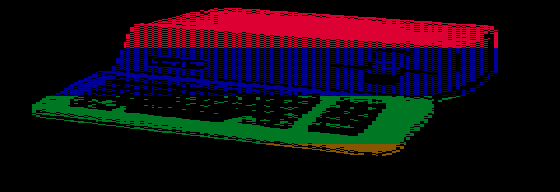

# Apple III accuracy fixes — 2026-09-07

The 13 reproducible defects in the [September 4 audit](ACCURACY_AUDIT_2026-09-04.md)
have been corrected. All five accuracy groups and all nine original regression
groups pass. The baseline for these corrections was
`f0069f46d107cae31e8af7bc53108b062e5a1455`.

## Changes and evidence

| Audit finding | Correction | Validation |
|---|---|---|
| 1 — disk protection | Gate each drive's track-cache write strobe with its protection input. | Both drives emit writes when writable (146/147 observed), zero when protected; protected cache contents and the unselected drive remain unchanged. |
| 2 — 140-pixel widths | The second 14-dot state starts at index 14, not 16. | All 28 dots match seven four-dot pixels, including the state boundary. |
| 3 — graphics scroll | Add the scroll offset modulo eight to the graphics row address. | 49,152 exact address/lane checks cover every visible row, every offset, both pages and both planes in all four graphics modes. |
| 4 — Apple II video decode | Decode TEXT/MIXED/HIRES separately from native modes; implement lores nibbles and the mixed text region. | TEXT overrides HIRES for both pixels and fetches; lores page/nibble selection and graphics/text transitions at scan line 160 pass. |
| 5 — non-RAM CPU slots | Feed actual RAM selection from the MMU to the scheduler. Protected RAM writes still select RAM. | 134,144 A-slot comparisons against the timing PROM cover both RAM selections, screen settings and CPU speeds. MMU tests cover ROM, VIA, I/O, protected writes and extended RAM. |
| 6 — refresh in VBL | Implement the scan PROM's refresh equations and final-six-line vertical counter mapping. | Zero differences in 16,768 ordinary states per frame, down from 216 at the baseline. |
| 7–9 — keyboard | Separate key validity from value; track modifiers independently and retain the set of held ordinary keys. | NUL, dual Shift/Control/Alt/GUI, release ordering, ANY-key-down, duplicate host make events and repeat fallback pass. |
| 10 — RTC GO | Clear fractions and seconds; round up at 40 seconds using the calendar carry chain. | The 39/40-second boundary, ordinary minute increment, midnight, week, month and year rollover pass. |
| 11 — RTC 10 Hz | Generate the tenth periodic event at the whole-second boundary. | A complete simulated second produces ten 10 Hz events and one 1 Hz event. |
| 12 — RTC rollover status | Arm a sticky detector on counter reads and clear it on status reads, including the 150 us update window. | Safe reads, reads inside the window, reads spanning a tick, persistence after the window, and clear behavior pass. |
| 13 — RTC reset retention | Initialize at FPGA configuration; keep time, comparator RAM and IRQ configuration running through machine reset. | Time and configuration survive reset; counters advance while reset is held. |

The original four scroll reproducers compared only the RAM word address.
The corrected rows can be sister bytes in the same word, so those checks now
compare the byte lane as well. The exhaustive address checks independently
calculate both parts. This corrects the test's observation rather than weakening
its expectation.

The fixes use the audit's primary sources: the [Apple service manual](https://mirrors.apple2.org.za/ftp.apple.asimov.net/documentation/apple3/service_reference_manual/Apple%20III%20Service%20Reference%20Manual-OCR-1982.pdf),
[original scan/timing PROMs](https://bitsavers.org/pdf/apple/apple_III/firmware/A3PROMs.zip),
and [National Semiconductor AN-353](https://bitsavers.org/components/national/_appNotes/AN-0353.pdf),
particularly printed pp. 16–17 and the rollover latch circuit in figure 23.
The PROM binaries remain external test inputs and are not redistributed.

## Integrated validation

The fresh ROM boot completes memory sizing, reconfiguration and entry to the
disk boot loop. The buffered SOS 1.3 System Utilities boot reaches the interpreter
through the real track cache: `bootstrap_A000=1`, `ext_fetch_ok=1`,
`loader_return=1`, `loader_jump=1`, `interpreter=1`, with zero loader errors,
disk read errors, retries or hard errors.

The raw DSK boot also reaches the interpreter with zero disk errors/retries and
completes the PS/2 script (D, Escape, Return, Down, Shift+D) against System
Utilities. The script observes the expected menu/prompt transitions.
[Recorded results](accuracy/2026-09-07-results.txt) include both boot summaries.

Quartus 17.0.2 under CrossOver completes the full build with **0 errors** and
25 warnings, with no critical warning or timing-requirements failure. Worst
constrained setup slack is **+0.333 ns**, hold slack **+0.211 ns**. The design uses
15,835/41,910 ALMs (38%) and 371/553 RAM blocks (67%). As in the baseline audit,
positive constrained slack is not complete interface timing sign-off.

```text
RBF SHA-256 bfaed1e3e223e8c99a68f8194a117a583f5a14b27787e392cfdea74b32ee19d5
RBF bytes   3665400
```

## MiSTer verification

The build was copied to a temporary core directory and its SHA-256 matched the
local RBF. The MiSTer returned to MENU before loading it, ensuring a fresh FPGA
configuration. Confidence Program 1.1 boots from a disposable raw DSK copy.

Video Test 7 (Apple /// Color Hires 140x192, page 1) was captured with both the
baseline and corrected bitstreams at native 560x192 resolution. Checking each
four-dot group gives **2,642 inconsistent groups before, zero after**, out of
26,880. The [test-title capture](accuracy/2026-09-07-video-test-title.png) identifies the same diagnostic/page.

| Baseline | Corrected |
|---|---|
|  |  |

The image check is reproducible with
`python3 sim/accuracy/check_140_capture.py docs/accuracy/2026-09-07-after-140.png`.
It validates pixel widths in this diagnostic, not full video or analog fidelity.

The [256 KiB memory diagnostic](accuracy/2026-09-07-memory-test.png) advanced
to **pass 5** with no reported error, establishing at least four completed
passes of the displayed RAM, zero-page/alternate-stack and indirect-addressing
tests.

SOS 1.3 System Utilities boots from a disposable raw DSK to its
[main menu](accuracy/2026-09-07-sos-menu.png). Sending D opens the
[Device Handling menu](accuracy/2026-09-07-sos-keyboard.png), confirming physical
MiSTer keyboard input after the fixes. The displayed legacy software date is
not evidence of synchronization to MiSTer's current host clock; RTC behavior
listed above was verified through register-level simulation.

The original [Apple II emulation loader](accuracy/2026-09-07-emulation-loader.png)
also reaches its startup menu. This is a loader smoke check; an Apple II
application disk was not booted in this run.

The tested build is installed at
`/media/fat/_Computer/Apple-III_20260907.rbf`; its hash matches the local artifact.
The September 4 RBF is preserved. MiSTer was returned to its original main INI
and MENU, with the main INI hash unchanged. The temporary core/disk directories
and capture INI were removed; Zaparoo was stopped to match its initial state.
All three disposable DSK copies retained their original hashes before removal.

## Reproduce

```sh
./sim/run_tests.sh
bash sim/accuracy/run.sh
./sim/run_core_boot.sh 30000000
sim/coretest/obj_dir/Vcore_tb 1400000000 research/disks/apple3.org/Apple3SOS1.3SysUtils.dsk --buffered
sim/coretest/obj_dir/Vcore_tb 1400000000 research/disks/apple3.org/Apple3SOS1.3SysUtils.dsk --rawdsk --keytest
./build.sh compile
```

The [accuracy test README](../sim/accuracy/README.md) identifies required PROM
files and tools. Full local logs are under the ignored
`research/accuracy-fixes-2026-09-07/` directory.

## Limits of this result

These corrections close the audit's reproduced defects, not every open accuracy
question. The extended HPE-state refresh decode, delayed peripheral IOSTOP/ready
waveforms, complete VIA behavior, active-display writes, and distributed
character-download timing still need dedicated verification or implementation.
The existing peripheral and media limits in the [README](../Readme.md#current-limitations)
remain. RTC retention covers machine reset, not FPGA reconfiguration or power loss.
