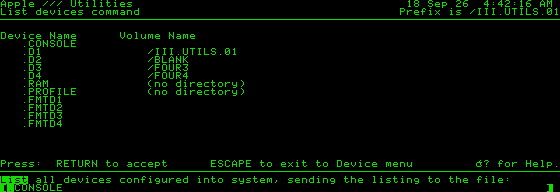

# Four Disk III drives

The internal drive and all three external drives are backed by independent WOZ
engines and Main image slots, S0–S3. Native selection follows SOS DISK3's
`UNITSEL`: external addresses 01, 10 and 11 select .D2, .D3 and .D4; 00 selects
none. The internal spindle can keep running while an external drive uses the
shared I/O bus. Apple II mode selects only drives 1 and 2.

The shared phase latch still supplies video fine scrolling. Only the selected
drive receives head phases, read flux and write strobes. Each drive retains its
own mount, track cache, file permissions, OSD protection and media-change latch.
A simultaneous phase-1 acknowledgement and another drive's media change update
both latches; a new mount takes precedence over acknowledgement on the same drive.

OSD protection keeps the previous drive-1/2 status bits, 6 and 7, and adds bits
11 and 12 for drives 3 and 4. Keyboard, serial and joystick settings keep their
existing bits. No MiSTer framework files were changed.

Main's future block assignments move from S2/S3 to S4/S5. This requires the
matching Main binary for four-drive cores; older two-drive WOZ cores still use
S0/S1. The Main changes and tests are on the companion checkout's `main` branch
and are also in
[`apple3-storage.patch`](../support/main/apple3-storage.patch).

SOS boot disks may configure only two drives. In System Utilities, read the
boot disk's `SOS.DRIVER` in the System Configuration Program, change **Number of
Disk III Drives** to **4**, then **Generate New System** to save `SOS.DRIVER`
on the boot disk. Reboot to activate the configuration.

Selection references: Apple's [SOS 1.3 source](https://apple3.org/Documents/SourceCode/SOS13Src.txt),
DISK3.USEL, and the Disk III motor/I/O and disk-switch descriptions referenced
in [Hardware design](DESIGN.md).

## Validation — 2026-09-18

- `make lint`, the selected-file format check and `git diff --check` pass.
- `sim/run_tests.sh` passes, including all four native selections, independent
  motors, flux and ready signals, deselection, media-change collisions, shared
  phase latches and exhaustive native-address combinations in Disk II mode.
- `sim/accuracy/run.sh`: zero failing groups, including write-protect sensing
  on each of the four drives with the other spindle running.
- `sim/disk/run.sh`: four real WOZ engines share one host bus, with overlapping
  mount requests and distinct cached data. Tests cover head/write isolation,
  file and OSD protection, ejection/replacement and reset with mounts retained.
- Main's address/undefined-behavior sanitizer suite passes: four simultaneous
  mounts, independent buffers and permissions, D4 sector write persistence,
  protected D3 writes, D2 replacement and D4 remount. Apple II/IIgs and all
  previous codec/write-back tests also pass.
- The exported Main patch applies to its documented upstream base and
  reproduces all 11 changed source and test files byte for byte.
- Stock-ROM SOS boot with four WOZ images, a warm reset during host I/O and
  71,590-clock host delays reaches the System Utilities menu. All loader
  milestones pass; no read, retry, recalibration, loader or hard errors occur.
  The simulation uses a 1.6-billion-half-cycle limit; the initial 700-million
  limit ended during normal interpreter loading before the menu appeared.
- Quartus 17.0.2 through CrossOver: full compilation succeeds with 0 errors and
  39 warnings. All 38 reported timing groups pass; minimum slack is +0.200 ns
  (hold), and minimum setup slack is +0.568 ns. The fitted design uses
  19,929/41,910 ALMs (48%) and 487/553 M10K blocks (88%).
- MiSTer hardware runs the paired build and lists volumes on .D1–.D4. Using
  disposable disk copies, SOS saves a four-drive configuration and formats
  .D3 as `FOUR3` and .D4 as `FOUR4`. Host checks confirm valid 280-block volume
  headers. After each format, only the selected image's SHA-256 changes;
  the other three images are byte-for-byte unchanged. After a full core/Main
  reload, SOS reads both persisted volumes again.

The tested RBF SHA-256 is
`8e89ed823b8e3e51709e156202086a40e5c128bd98a20db3f8b2cbb1d895e3b5`.
The paired Main SHA-256 is
`ac0688117c185bc5d7d67cc5c6cddd781997ac8f12f1f75c987329a8ffd696f2`.
