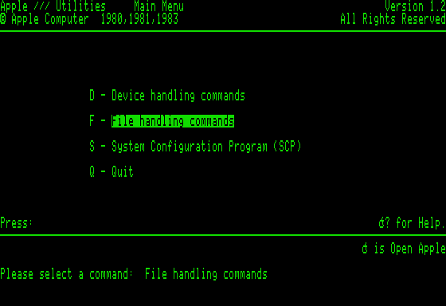
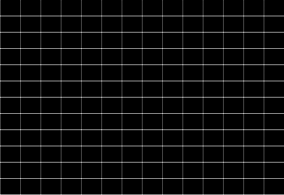

# Apple /// Plus text interlace

**Model** in the OSD selects the Apple /// Plus, which adds that machine's
keyboard and its **Text Interlace** switch. With the switch on the machine
sends two fields of 262 and 263 lines, half a line apart, for a 525-line
interlaced frame of 560 × 384. MiSTer's scaler weaves the two fields into one
picture; the analog output carries them as a CRT expects them.

What the two fields show is the machine's, not a line doubler's:

* A program on display page 1, which is nearly all of them, gets the same
  picture in both fields. The second field fills the gaps between the first
  one's scan lines, which is Apple's "more crisply defined character".
* A program that selects page 2 in a native mode gets page 2 in the upper
  field and page 1 in the lower: two 192-line pages merged into one 384-line
  picture. Apple's developer mailing sold this ("allows you to merge pages 1
  and 2 of screen memory"), and ON THREE warned about it ("the contents of
  buffer 1 and buffer 2 will be interlaced, providing you with a very
  eye-straining experience").
* Apple II emulation shows the selected page in both fields.

With the switch off, or the Apple /// model, nothing differs from an Apple ///.

## The hardware

Apple sold the same parts as a kit for the Apple /// (A3M0021): a replacement
for the scan PROM at G9, and a switch on a cable. Nothing else on the board
changes, because sheet 10 of the 1980 schematic already has the rest.

**Field flip-flop.** The scan PROM's D6 is RFIELD. G10, the latch that
registers the PROM's outputs every horizontal state, turns it into FIELDOUT on
pin 2 of J19, and pin 3 of J19 is FIELDIN, which goes to pin 18 of the PROM
socket with R63, 3K, to ground. The stock 341-0030 ignores pin 18 and holds
RFIELD high. In the Plus PROM, 342-0145-A, RFIELD is true at one address
only: line 448, the first of vertical blanking, at H5..H2 = 0. That is the
one group of horizontal states that lasts an odd number of clocks, five,
because the extended state repeats H = 0. With FIELDOUT returned to FIELDIN
the PROM and its latch therefore make a flip-flop that changes over once a
frame as blanking begins, and stays put through the picture.

**The switch.** ON THREE's installation notes put the cable's two-pin
connector on FIELDOUT and FIELDIN and its third wire on position 4 of J20,
which is FORCPAGE, pin 6 of the mode PROM (342-0032) with a 1K pull-up in
RP10. Switch open, 1K to +5 V against 3K to ground leaves FIELDIN and
FORCPAGE high: the ordinary field and ordinary paging, for good. Switch
closed, both follow the flip-flop.

**The long field.** FIELDIN low selects the half of the 342-0145-A that the
archived dump holds. Against the 341-0030 it differs in four ways, all in
vertical blanking:

| | 341-0030, and FIELDIN high | 342-0145-A, FIELDIN low |
|---|---|---|
| COMP entering line 508 | 0 | 1: the counter's VA reloads to 1 and line 508 becomes 509 |
| COMP at the end of line 511 | 1: reload to 250 | 0: reload to 248 |
| Lines | 256..511, 250..255 = 262 | 256..507, 509..511, 248..255 = 263 |
| Vertical sync (six broad pulses) | H = 16 of line 483 to H = 8 of 486 | H = 48 of line 483 to H = 40 of 486 |
| Refresh | | one more slot at H = 16..19 where V1..VA = 11101, for the addresses line 508 took with it |

The sync pulses of successive fields are then 262 lines and 33 states, and 262
lines and 32 states apart: 525 lines to the pair, and the half line that
places one field's scan lines between the other's. The field that starts half
a line early is the upper one. It is also the one with FIELDIN and FORCPAGE
high, so page 2, when selected, is the upper picture.

**FORCPAGE.** Every page 2 term of the mode PROM that belongs to a native mode
carries FORCPAGE; the emulation terms do not. Over the whole PROM, FORCPAGE low
gives exactly the outputs of PAGE2 off in native mode and changes nothing in
emulation. The core applies that to the page select it already had.

## What is inferred

The archived 342-0145-A dump is 2048 bytes, read with pin 18 low. The half
selected by FIELDIN high is not in it. It has to be the 341-0030's timing,
and the core uses that: the long field is exactly one line longer and its sync
exactly half a line later than the 341-0030's, which interlaces only against a
field of that shape, and FIELDIN high is also the switch-off state, which is a
normal 262-line Apple ///. The flip-flop needs RFIELD in that half to be the
complement of the archived one; the core changes the field over once, at the
first of the five clocks.

## In the core

* `apple3_timing` holds the flip-flop, counts the long field's lines with the
  real vertical counter (`scan_line`) and adds its refresh slot, which the
  processor cannot use.
* `apple3_video` forces page 1 in the lower field of a native mode and takes
  vertical sync from the PROMs' broad pulses. That also applies with the
  switch off, where sync used to be lines 480 to 483: the analog picture sits
  three lines higher than in earlier builds, where the motherboard puts it.
* The wrapper drives `VGA_F1` for the scaler, high in the lower field, whose
  lines the scaler weaves into the odd rows.
* The framework's `video_freak` sizes the picture for the **Scale** options by
  the lines between vertical syncs, which is one field. With the switch on
  the wrapper shows it the upper field's sync alone, so it measures the woven
  384 lines: V-Integer on a 1080-line display is 768 lines, twice the frame,
  where the field's 192 would give 960 and two and a half.

## Results, 2026-09-19

Quartus 17.0 closes timing with 0.773 ns of setup slack. On a MiSTer, with
the options preset through `Apple-III.CFG`, screenshots come from the scaler at
560 × 384 with the switch on and at 560 × 192 with it off or with the Apple ///
model selected.

* **SOS 1.3 System Utilities** boots to its menu with the 262 and 263 line
  fields alternating. Every pair of rows is identical, and the picture matches
  the simulated one dot for dot.

  

* **Business BASIC 1.23 with `.GRAFIX`.** A program draws horizontal lines in
  buffer 1 of the 560 × 192 mode and vertical lines in buffer 2, then shows
  buffer 2. Every even row of the picture holds the vertical lines alone and
  every odd row the horizontal lines alone: page 2 in the upper field, page 1
  in the lower. Showing buffer 1 instead makes every pair of rows identical.

  

* **Apple /// Plus dealer diagnostics, video test.** All of its screens
  report two identical fields except its interlace test, which puts a
  horizontal line in page 2 and a vertical one in page 1 and shows page 2. With
  the switch off only the horizontal line appears. With it on the two make a
  cross, the horizontal line on an even row and the vertical line on the odd
  rows, and the disk reports VIDEO (PASSED) either way.

  

  The disk is a DOS 3.3 volume 1 and needs the companion Main that takes a
  sector image's volume from its [VTOC](MAIN_STORAGE.md); before that it
  stopped at VOLUME MISMATCH.

## Tests

* `sim/accuracy/interlace_tb.sv`: line sequences and lengths of both fields,
  sync positions and spacing, an unchanged field through every picture, page
  forcing in native graphics and text, no forcing in emulation, and the
  switch going off again.
* `sim/accuracy/interlace_prom_tb.sv`, when the PROM dumps are present:
  every state of both fields against the binary 342-0145-A and 341-0030 for
  refresh, character window and blanking; the line sequence derived from COMP
  alone; RFIELD; and the sync pulse against the PROMs' broad pulses.
* `sim/run_core_boot.sh ... --interlace --frame-out=frame.ppm` runs the whole
  machine with the switch on and saves two fields woven into 560 × 384.
  System Utilities boots to its menu with both fields identical.
