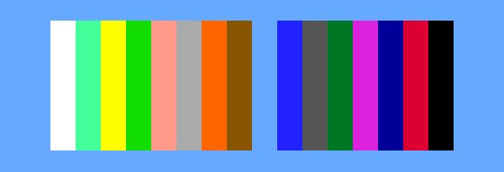
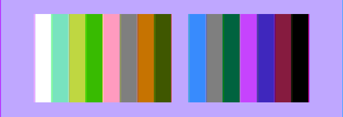
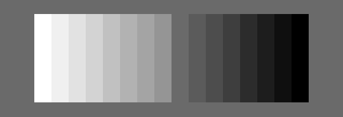
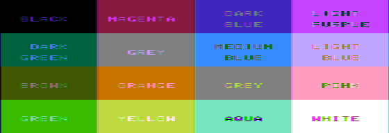
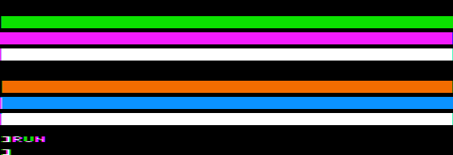
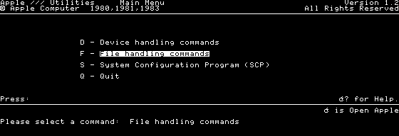
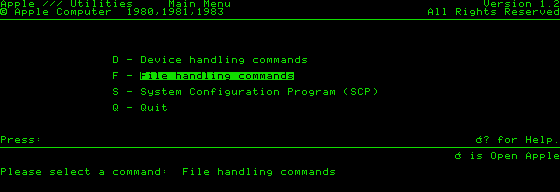
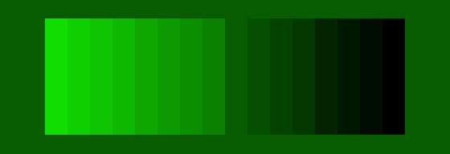

# Video sources

The Apple /// has three video outputs, and the OSD's **Video** option chooses
which one the core shows:

| Video | Motherboard output | Picture |
|---|---|---|
| RGB | XRGB1, 2, 4, 8 (J5 pins 5, 9, 2, 10) | Sixteen RGB colours; monochrome modes white on black |
| Color Composite | NTSC (J5 pin 12) | Decoded NTSC: the ///'s own colours, and Apple II artifact colour |
| Mono Composite | B/W video (RCA jack, J5 pin 11) | Sixteen shades of grey at full resolution |

All three are made from the same four colour lines, RGB8..RGB1 out of H3 on
sheet 6 of the schematic. `apple3_video` produces those lines for every dot,
and `apple3_composite` holds the two summing networks and the monitor on each
output. The picture stays in the same place when the source changes: every
source leaves the monitor four dots after it arrives, with blanking and sync
to match.

With **Mono Composite** the OSD also offers **Phosphor**, White or Green: the
monitor on the B/W jack, not a fourth output. White is the default.

## Colour lines

* The colour latch F3 drives the lines only in the colour modes (OE374 of PROM
  342-0032: colour text, 280 × 192 colour, Apple II lores). Elsewhere RP8 and
  RP13 pull the foreground to 1111 and the background to 0000, so 40 and 80
  column text and both monochrome graphics modes are white on black on every
  output. The RGB picture used to render 80-column text alone in green, a
  choice borrowed from MAME; the lines say white, so it is white now, and
  green is the monitor option below.
* **Bit 7 delay.** J3 selects BT1, the serial bitmap one 14M clock late, while
  the byte on display has bit 7 set. DHIRES enables it, so it applies to Apple
  II hires and to the native 280 × 192 modes, and to each half of a 560 × 192
  state by its own byte's bit 7. The first dot of a late byte is still the last
  dot of the byte before it; at the left edge that is whatever the scanner read
  before column 0. This is the Apple II's half-dot shift, and it is on all
  three outputs because it happens before H3. The schematic labels J3's pins
  1 and 2 as I2 and I3; a 74S151 has them the other way round, which is the
  reading that delays bytes with bit 7 set, as an Apple II does.

## Mono Composite

RP4 sums the lines through 18K, 9.1K, 4.3K and 1.8K (RGB1, 2, 4, 8) into Q4.
The core scales those conductances to 15, 29, 62 and 149, so white is 255.
Colour numbers are therefore a grey scale that darkens from 15 to 0, as the
Service Reference Manual says of its colour-bar test, with a larger step
between 7 and 8 because RGB8 weighs ten times RGB1 rather than eight. Nothing else
reaches this output: no chroma, no burst and no filtering, so 80-column text and
560 × 192 graphics keep every dot.

**Phosphor.** The monitor Apple sold for this jack was the Monitor ///, a
12-inch P31 green tube with 18 MHz of bandwidth, enough for every 14M dot.
Green shows the B/W signal on it: each grey level times `11dd00`, the green
the RGB picture gave 80-column text before. It is the whole signal in every
mode, so text and monochrome graphics are green on black and the colour modes
keep their sixteen levels. It is a presentation of this output only; RGB and
Color Composite ignore it.

## Color Composite

RP3 sums the four lines with equal weight (6.2K each) and adds NTSCA and NTSCB
(5.1K each). L8, a 74LS153 addressed by C7M and C3.5M, makes those two: in
subcarrier slot *k* NTSCA is line *k* of RGB1, RGB2, RGB4, RGB8 and NTSCB is
the inverse of line *k* + 2. The signal is therefore

    level = 51 × (lines set) + 62 × (line[k] − line[k + 2])

which is luma plus one cycle of chroma whose phase is the colour number's bit
pattern, the scheme of Apple II low resolution. There are four slots to a
cycle and 228 cycles to the 912-dot line, so the pattern is the same on every
line.

* **Slot alignment.** A serial bitmap dot lands in the slot of its position in
  each group of four dots. In 140 × 192 mode H3 is clocked once a cycle, by the
  clock that ends slot 1 (CKDSP, from H2), and holds the four bits that arrived
  in slots 2, 3, 0, 1; passed through the two registers of the serial path
  instead, the same bits would occupy slots 0 to 3. So a bitmap pattern and
  the 140-mode colour with the same bits have the same hue, even hires columns
  fill slots 0–1 and odd columns slots 2–3, and bit 7 moves either one slot
  later: violet, green, blue and orange, as on an Apple II.
* **Colour burst.** K8 gates the burst with −COLRKL of PROM 342-0032. It is
  present for colour text, 280 × 192 colour, 140 × 192 colour and all Apple II
  graphics, including the text lines of mixed mode, which fringe as they do
  on an Apple II. It is absent for black-and-white text, 80-column text,
  280 × 192 and 560 × 192 monochrome and Apple II text.
* **Monitor.** The monitor samples the burst enable as each line's sync pulse
  ends. On a line without a burst its colour killer shows the whole signal as
  luma at full bandwidth, so 80-column text stays sharp. With a burst it
  takes four dots, one subcarrier cycle, at a time: their mean is luma, slot 0
  less slot 2 is the R−Y axis and slot 1 less slot 3 the B−Y axis, through the
  NTSC matrix at 0.8 saturation. That places colours 1, 2, 4 and 8 at magenta,
  dark blue, dark green and brown, the names the Owner's Guide gives them.
  The burst's absolute phase through the L1/C5 tank is not derivable from the
  schematic; this is the tint setting that yields the documented colours.

| | 0 | 1 | 2 | 3 | 4 | 5 | 6 | 7 |
|---|---|---|---|---|---|---|---|---|
| NTSC | `000000` | `861b3f` | `3f27bd` | `c643fd` | `00633f` | `7f7f7f` | `388bfd` | `bfa7ff` |
| B/W | 0 | 15 | 29 | 44 | 62 | 77 | 91 | 106 |
| Green | `000000` | `010d00` | `021900` | `032600` | `043600` | `054300` | `064f00` | `075c00` |

| | 8 | 9 | 10 | 11 | 12 | 13 | 14 | 15 |
|---|---|---|---|---|---|---|---|---|
| NTSC | `3f5700` | `c67301` | `7f7f7f` | `ff9bbf` | `38bb01` | `bfd741` | `78e3bf` | `ffffff` |
| B/W | 149 | 164 | 178 | 193 | 211 | 226 | 240 | 255 |
| Green | `0a8100` | `0b8e00` | `0c9a00` | `0da700` | `0eb700` | `0fc400` | `10d000` | `11dd00` |

The two greys are one colour on the NTSC output, since their chroma cancels.
Apple II hires dots swing the full black-to-white range, so their artifact
colours are more saturated than the native ones: violet `f31cff`, green
`0be200`, blue `0b92ff`, orange `f36c00`.

Not modelled: the monitor's own luma bandwidth (the Service Reference Manual
warns that 80-column text is hard to read on a colour monitor; here a killed
line is sharp), and the left-edge flicker Apple describes for Apple II hires.

## Results, 2026-09-18

Quartus 17.0 closes timing with 0.592 ns of setup slack. On a MiSTer, with the
Video option preset through `Apple-III.CFG` and screenshots taken at the
core's 560 × 192:

* **Confidence Program 1.1, Video Tests 1–10** on each source. The colour-bar
  test measures exactly the NTSC and B/W values in the tables above, in the
  order the Service Reference Manual gives, white to black. Apple ][ Hires,
  Super Hires and the 80-column menus are two-colour and sharp on all three;
  the three colour modes are decoded in colour on NTSC. The RGB bars measure
  the same palette values as before.

  
  
  
  

* **Apple II emulation disk, Applesoft without DOS** (RETURN, then RESET). A
  program that fills a band with each `HCOLOR` gives green, violet, white,
  black, orange, blue and white for 1 to 7, the Apple II's own assignment,
  at exactly the artifact values above, and the mixed-mode text below it
  fringes. This is the check on the slot alignment and on the direction of the
  bit 7 delay that does not rest on the schematic.

  

## Results, 2026-09-20: neutral RGB and the Phosphor option

Quartus 17.0 closes timing with 0.605 ns of setup slack (the framework's HDMI
clock; the machine's own clocks have 5.8 and 11.0 ns). On a MiSTer, options
preset through `Apple-III.CFG`, screenshots at the core's 560 × 192, which is
the frame before the scaler presents it at 4:3:

* **System Utilities (80-column text) on RGB, default options.** Two colours,
  `000000` and `ffffff`, and no pixel differs from the simulated machine's
  frame (`sim/run_core_boot.sh ... --to-menu --frame-out`). Mono Composite, and
  RGB and Color Composite with the Phosphor bit set, give that same picture
  exactly.
* **The same screen on Mono Composite, Phosphor Green.** Two colours, `000000`
  and `11dd00`; the same 4,788 dots are lit as on RGB, and the frame is
  byte-identical to the simulated `--video=green` one.

  
  

* **Confidence Program 1.1, Video Tests 1–10 on Phosphor Green.** Every
  screen contains only values from the green row of the tables above. The
  colour-bar test shows all sixteen in order, white to black, 28 dots a bar;
  the two colour-text tests show levels 5 and 9, and 4 and 13, so the colour
  modes keep their greys in green.

  

## Tests

* `sim/composite_tb.sv`: the sixteen NTSC colours, the four artifact colours,
  the colour killer, the grey ladder in white and in green, single green dots
  as sharp and as late as white ones, and the four-dot latency of every source.
* `sim/video_tb.sv`: the bit 7 delay in each bitmap mode, the subcarrier slot,
  white 80-column text on the colour lines and the RGB picture, and −COLRKL
  for all 32 mode settings.
* `sim/accuracy/video_fetch_tb.sv`: its independent renderer includes the bit 7
  delay, over random memory in every mode.
* `sim/accuracy/video_source_tb.sv`: whole frames through the scan counters,
  RAM, video generator and monitor. Apple II hires fill bytes decode to violet,
  green, blue, orange and white on NTSC and stay black and white on RGB and
  B/W; mixed-mode text fringes and plain text does not; 80-column text is
  sharp on NTSC and white on black on B/W and RGB; 140-mode colour bars give
  the tables above. On a green phosphor hires and 80-column text are `11dd00`
  on black dot for dot, the bars are the green row of the table, and RGB and
  NTSC frames do not change with the option. `+FRAMES=<directory>` saves each
  frame as a PPM.
* `sim/run_core_boot.sh ... --frame-out=frame.ppm --video=color` (or `mono`,
  or `green` for the B/W jack on a green phosphor) takes the whole machine's
  picture from the chosen source.
